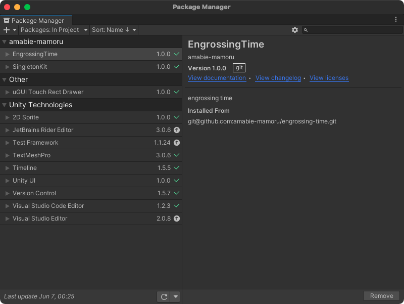
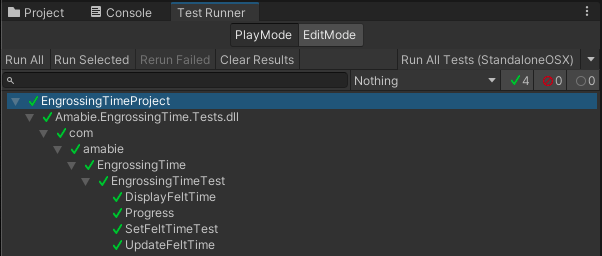

# engrossing-time

game time manager for unity

## Get started

First, [Window] -> [Package Manager] on Unity Editor menu bar.

Second, Click [+] button and select [Add package from git URL...]


And finally, copy following url and paste in package manager text box.

```
git@github.com:amabie-mamoru/engrossing-time.git
```



Let's enjoy 🧜🏼‍♂️

# Features

## EngrossingTime

### Interface

#### Instance variables

Variable Name | Description
--- | ---
FeltTerm.BeginningTime | Beginning time (sec)
FeltTerm.EndingTime | Ending time (sec)
DisplayFeltTime | Spent time (sec)
Progress | Progerss (%)

#### Instance methods

Method Name | Description
--- | ---
SetFeltTerm(float beginningTime, float endingTime) | Set beginning / ending term (sec)
SetFeltTerm(float endingTime) | Set ending term (sec). beginning time is zero.
UpdateFeltTime(float deltaTime) | Update felt time (sec)

### Usage
```cs
using UnityEngine;
using UnityEngine.UI;
using com.amabie.EngrossingTime;

public class Sample : MonoBehaviour
{
    [SerializeField]
    private Text progress;

    [SerializeField]
    private Text feltTime;

    private EngrossingTime engrossingTime;

    void Awake()
    {
        engrossingTime = new EngrossingTime();
        engrossingTime.SetFeltTerm(50f);
    }

    void Update()
    {
        engrossingTime.UpdateFeltTime(Time.deltaTime);
        progress.text = engrossingTime.Progress + " [%]";
        feltTime.text = engrossingTime.DisplayFeltTime + " [s]";
    }
}
```

# Support

see test codes.


